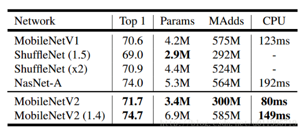

### MobileNet（V1/V2）

**1. 模型准确率（Top1/5 err on ImageNet-1k Val)/推理速度及下载地址.**

 Network|224 (single-crop)|F/B(224)|Download (BaiduCloud)|Source
 :---:|:---:|:---:|:---:|:---:
 mobilenet_v1| 29.19/10.15 | 4.3ms/..ms | [16.2MB](https://drive.google.com/open?id=0B7ubpZO7HnlCVFFJQU5TQ0dkLUE) | [mobilenet-v1-hik](https://github.com/shicai/MobileNet-Caffe)
 mobilenet_v2| 28.10/9.51 | 3.9ms/..ms | [14.2MB](http://oys4dsw99.bkt.clouddn.com/mobilenet_v2.caffemodel) | [mobilenet-v1-hik](https://github.com/shicai/MobileNet-Caffe)

**2. 模型预处理参数.**

 Network|mean_value|std
 :---:|:---:|:---:
 mobilenet v1 | [103.94,116.78,123.68] | [58.82, 58.82, 58.82]
 mobilenet v2 | [103.94,116.78,123.68] | [58.82, 58.82, 58.82]

**3. 模型分析.**

    - 谷歌轻量化（移动端）模型的代表作，代表着现阶段轻量化模型的最高峰
    - V1版本是17年的，依照传统复古结构简化而来，已经有不错的成效
    - V2版本是18年新作，良心之作，代表了谷歌的分类上的功力！关键改进是Inverted residual和Linear Bottlenecks~（目前放出的model还没有完全重现论文结果，有待后续提升，不过可以先尝试使用，比V1效果好）
    - 用于移动端（轻量化）的pretrain model的不二之选

**4. 主流移动端模型枚举.**

 - Figure: 主流移动端准确率与CPU推理速度
